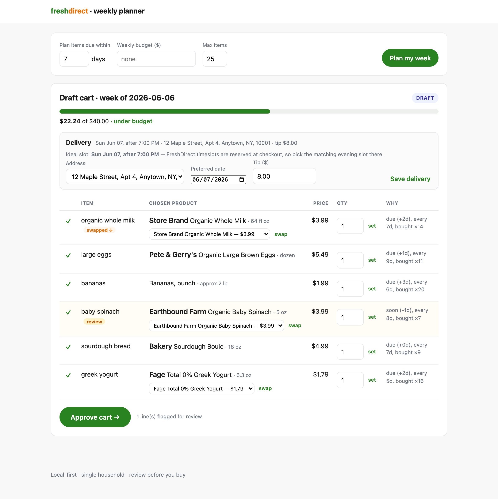

# FreshDirect Weekly Planner

An AI agent (plus web app) that plans a household's weekly **FreshDirect** grocery
order. It studies your order history, predicts which staples are due for restock,
proposes a few meals, builds a draft cart with live prices, keeps the total under
a weekly budget (suggesting cheaper swaps when it runs over), and presents the
whole thing to the household manager for review and approval. On approval it hands
off a ready-to-checkout cart.

> Local-first and single-household by design: a stored FreshDirect session grants
> full access to your account, so everything runs on your own machine/server and
> the session is encrypted at rest.

## Preview



The household manager's review dashboard — a draft cart with live prices and a
budget bar, cheaper-swap suggestions, a low-confidence line flagged for review,
and the preferred Sunday-evening delivery slot — all before you approve and hand
off a ready-to-checkout cart. _(Shown with synthetic demo data.)_

## Status

**Phase 0 — automation spike: done.** We log into FreshDirect through real Chrome
(past Akamai) and read full order history + line items via their GraphQL API.

| Phase | Scope                                                                                                          | State         |
| ----- | -------------------------------------------------------------------------------------------------------------- | ------------- |
| 0     | FD login + order history & line items via GraphQL (+ paste fallback)                                           | ✅ done       |
| 1     | SQLite persistence, resumable backfill, spend tracking + replenishment                                         | ✅ done (CLI) |
| 2     | Profile ✅ · search ✅ · SKU match ✅ · restock draft plan + budget ✅ · meals (later)                         | ✅ done (CLI) |
| 3     | Review dashboard ✅ · edit/approve ✅ · cart hand-off ✅ · delivery ✅ · email digest ✅ · weekly scheduler ✅ | ✅ done       |
| 4     | (future) Auto-checkout behind a flag                                                                           | planned       |

## Setup

Requires [uv](https://docs.astral.sh/uv/) and **Google Chrome installed**
(the scraper drives your real Chrome to get past FreshDirect's bot defense —
see "Why real Chrome?" below).

```bash
uv sync                                 # install dependencies
uv run playwright install chromium      # optional: bundled-Chromium fallback only
cp .env.example .env                     # optional: configure budget, SMTP, schedule
```

The optional weekly scheduler needs an extra:

```bash
uv sync --extra scheduler
```

## Phase 0 usage

```bash
# One-time: opens real Google Chrome so you can log in (handles 2FA/captcha).
# The session persists in a dedicated Chrome profile under ./data/.
uv run fdplanner login

# Read your recent orders to confirm the pipeline works.
uv run fdplanner history --limit 5
# Include line items (one extra page load per order):
uv run fdplanner history --limit 3 --details
# If a headless run gets challenged, run it visibly on the warm profile:
uv run fdplanner history --limit 5 --headed

# If automation is ever blocked, paste an order export instead:
uv run fdplanner import-paste path/to/orders.txt
```

## Phase 1 usage (analytics)

```bash
# One-time (resumable): sync full history + line items into ./data/fdplanner.sqlite
uv run fdplanner backfill

# Spend totals, monthly trend, category breakdown
uv run fdplanner spend

# Items predicted due for restock, most overdue first
uv run fdplanner due

# Infer a dietary profile from what you buy (saved to data/profile.json)
uv run fdplanner profile

# Search the live catalog
uv run fdplanner search "organic whole milk"

# Resolve a free-text need to a real SKU (alias → heuristic → optional Claude)
uv run fdplanner match "organic whole milk"
# Teach the right product so future matches resolve instantly
uv run fdplanner match "organic whole milk" --teach DAI0059088

# Build a restock draft cart from items due, priced live, under a budget cap
uv run fdplanner plan --horizon 7 --budget 200

# Cache your saved delivery addresses (for the dashboard's address picker)
uv run fdplanner addresses

# Or use the web dashboard: review, edit, swap, set delivery, approve, hand off
uv run fdplanner serve            # → http://127.0.0.1:8000

# Email a review digest for the latest plan (writes an HTML preview if SMTP unset)
uv run fdplanner digest

# Run the weekly job once now: build this week's draft + send the digest
uv run fdplanner run-weekly

# Or run it on a schedule (Sat 07:00 by default) — needs the scheduler extra
uv sync --extra scheduler
uv run fdplanner schedule
```

The dashboard (`app/web/`, FastAPI + Jinja, server-rendered so it works without
client JS) lets the household manager **review** the draft cart, **edit**
quantities, **remove** items, **swap** to a cheaper/different product (which is
learned as an alias), watch the **budget bar**, **approve**, and then **send the
approved cart to FreshDirect** behind an explicit confirm. Hand-off
(`app/handoff.py`) drives the real "Add to bag" buttons to populate your cart
(quantity 1 per line; set higher quantities in the cart) and returns a checkout
link — it never places the order or pays. You review and check out yourself.

The plan also carries a **delivery** choice: pick which saved address this week's
order goes to (e.g. home vs. a different address that week), a preferred date, and
a tip (`app/delivery.py` reads your saved addresses; timeslots stay perishable and
are reserved by you at checkout).

The **autonomous weekly loop** closes Phase 3: `fdplanner schedule` runs a
weekly cron job (`app/scheduler.py`, APScheduler — the optional `[scheduler]`
extra) that wakes on a schedule, builds this week's draft, and emails the
household manager a **digest** (`app/notify/email.py`) summarizing the cart,
budget, delivery, and any flagged lines, with a deep link to review and approve.
SMTP is configured via env vars (`FDPLANNER_SMTP_HOST`, `FDPLANNER_SMTP_USER`,
`FDPLANNER_SMTP_PASSWORD`, `FDPLANNER_DIGEST_TO`, `FDPLANNER_DASHBOARD_URL`); with
no SMTP set, the digest is written as an HTML preview under `data/digests/`. The
job stops at the draft + notification — it never places an order, same boundary
as the manual flow. `fdplanner run-weekly` runs that job once on demand.

The draft plan (`app/planner.py`) takes the items due, prices each against the
live catalog — preferring the _exact_ product you've bought before (its
historical `product_id`) — then reconciles against the weekly cap with
cheaper-swap suggestions (`app/budget.py`, pure + tested). Low-confidence matches
are flagged for review. Meal planning will layer on top once an API key is set.

Matching (`app/match.py`) scores search candidates on term overlap, brand,
organic, and single-unit-vs-multipack, with **ambiguity-aware confidence** (a
toss-up isn't reported as certain) so weak matches flag for review. Corrections
are remembered as aliases; with an Anthropic key, Claude re-ranks the shortlist.

`profile` works fully offline from the data (organic preference, plant-forward
lean, proteins, household signals like a baby in the house). If
`FDPLANNER_ANTHROPIC_API_KEY` is set it also refines the draft with Claude
(`app/ai.py`, prompt-cached, structured tool output).

Money is stored as integer cents (`app/money.py`) so sums stay exact. The
replenishment forecast (`app/analytics.py`) estimates each item's buying cadence
from how often it appears across orders and flags what's due.

> **Why real Chrome?** FreshDirect uses Akamai Bot Manager, which 403s throwaway
> automation (Playwright's bundled Chromium advertises `navigator.webdriver`). We
> drive real Google Chrome (`channel="chrome"`) from a dedicated persistent
> profile with the automation flags removed, so the browser looks genuine.

> **How history is read.** FreshDirect's account pages are a React SPA backed by
> a GraphQL API. Instead of scraping hashed-classname DOM, we boot the app and
> intercept its GraphQL **responses** by operation name — `ordersHistory` (the
> order list) and `order` (each order's line items) — and parse that JSON. Far
> more robust than CSS selectors. See `app/freshdirect/history.py`.

## MCP server

The auth + data pipeline is also available as an [MCP](https://modelcontextprotocol.io)
server, so an MCP client (Claude Desktop, Claude Code, etc.) can call it directly
instead of going through the CLI:

Install it as a tool (no repo checkout needed), which puts `fdplanner` and
`fdplanner-mcp` on your PATH:

```bash
uv tool install "git+https://github.com/erikleon/fresh-direct-tool.git[mcp]"
```

Then register it with a client — the command has no machine-specific path:

```bash
claude mcp add fresh-direct -- fdplanner-mcp
```

Or run from a checkout for development: `uv sync --extra mcp && uv run fdplanner-mcp`.

The `[mcp]` extra is required — installing without it makes the server fail to
import `mcp` at startup, which a client reports only as "failed to connect."

**Where state lives.** The SQLite DB and the Chrome session profile default to a
per-user OS data dir (`platformdirs`, e.g. `%LOCALAPPDATA%\freshdirect-planner`
on Windows) so the CLI and the MCP server agree no matter which directory the
client launches the server from. Override with `FDPLANNER_DATA_DIR`. Since an MCP
client launches the server from an arbitrary working directory, pass config as
environment variables rather than relying on a `.env` file, e.g.:

```bash
claude mcp add fresh-direct \
  -e FDPLANNER_ANTHROPIC_API_KEY=sk-ant-... \
  -e FDPLANNER_WEEKLY_BUDGET=200 \
  -- fdplanner-mcp
```

Tools exposed:

| Tool             | Reads live FreshDirect? | Description                                          |
| ---------------- | :----------------------: | ----------------------------------------------------- |
| `fd_session_status` |            no            | Whether a session is saved (no browser)                |
| `fd_history`        |            yes           | Recent orders (+ line items) via GraphQL               |
| `fd_backfill`       |            yes           | Sync full history into the local DB (resumable)        |
| `fd_spend`          |            no            | Spend totals / monthly trend / category breakdown      |
| `fd_due`            |            no            | Replenishment forecast — staples due for restock       |
| `fd_search`         |            yes           | Live catalog search                                     |
| `fd_match`          |            yes           | Resolve free text to a real SKU (alias → heuristic → AI)|
| `fd_teach_match`    |            no            | Correct a match so it resolves instantly next time      |
| `fd_profile`        |            no            | Infer (and save) a household dietary profile            |

Login stays a manual, interactive step — `uv run fdplanner login` opens a real
Chrome window for 2FA/captcha, which can't be driven from an MCP tool call.
Once logged in, `fd_session_status` confirms the saved session and the other
tools reuse it. Planning, cart hand-off, and checkout aren't exposed here; use
`fdplanner plan` / `fdplanner serve` for those.

## License & responsible use

MIT — see [LICENSE](LICENSE). This tool automates **your own** FreshDirect
account for personal household use; keep request volume human-like and review
FreshDirect's Terms of Service before using it. It never places an order or
handles payment — you review and check out yourself.

## Security notes

- The FreshDirect session lives in a **dedicated** Chrome profile at
  `data/chrome_profile/` — never your main Chrome profile. Its cookies are
  encrypted at rest by the OS keychain (Chrome Safe Storage).
- `data/` and `.env` are git-ignored. Never commit them.

## Layout

```
app/
  config.py            # settings (env-driven)
  cli.py               # CLI: login / history / backfill / spend / due / import-paste
  mcp_server.py         # MCP server: auth status + data pipeline as tools
  money.py             # Decimal dollars <-> integer cents
  db.py, models.py     # SQLite engine + SQLModel tables (orders, order_items)
  ingest.py            # resumable backfill into the DB
  analytics.py         # spend summary + replenishment cadence (pure + DB-backed)
  scheduler.py         # autonomous weekly run: build draft -> email digest
  notify/email.py      # weekly email digest (pure render + SMTP send/preview)
  freshdirect/         # automation adapter, isolated behind an interface
    base.py            #   adapter Protocol + domain models (Order/OrderItem/Address)
    session.py         #   real-Chrome login + persistent-profile reuse
    client.py          #   booted SPA session: order_summaries / order_lines
    parse.py           #   GraphQL/text → domain models (pure, tested)
    history.py         #   paste fallback
    debug.py           #   dev tools: dump page HTML, capture network/API
```
